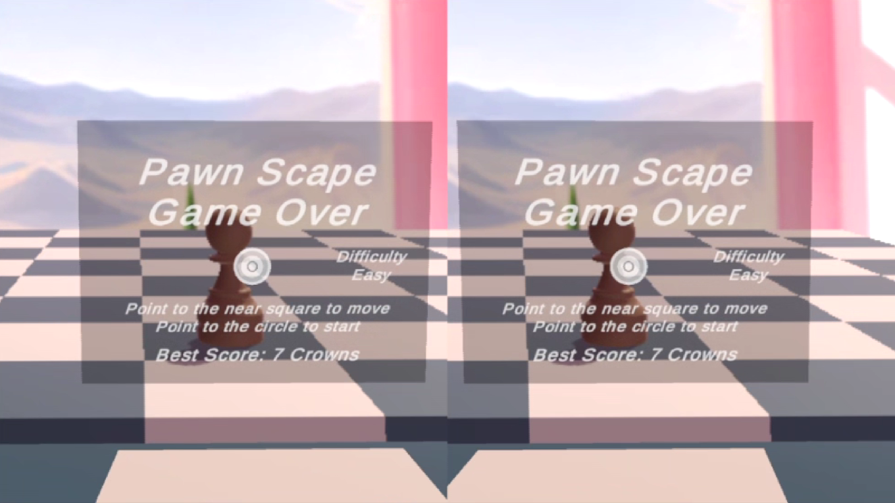

# Chessboard Escape VR

Chessboard Escape VR is a virtual reality (VR) game developed in Unity using the Google Cardboard platform. The project was initially created within a 24-hour timeframe to conceive the gameplay idea and implement basic functionality. It has been further refined, refactored, and enhanced with custom models for improved VR experience.

## Gameplay

The objective of the game is to collect crowns while evading an enemy chess piece that relentlessly pursues the player. The player can move horizontally or vertically by looking at squares adjacent to the chessboard. The game offers four difficulty levels:

- **Easy**: The enemy chess piece moves one square horizontally and vertically.
- **Medium**: The enemy chess piece moves one square vertically.
- **Hard**: The enemy chess piece moves diagonally like a bishop.
- **Rook**: The enemy chess piece moves horizontally or vertically like a rook.

To start the game, the player needs to approach the HUD at the mirror and look at the circle in the middle of the screen until it fills up, indicating the start of the gameplay.

## User Interface

The game features a simple Heads-Up Display (HUD) accessible through a mirror object. Due to time constraints, the HUD is minimalistic but functional. To change the difficulty level, the player can approach and look at the difficulty indicator. Additionally, the central circle starts filling up when the player looks at it, signaling the start of the game.

## Installation

To play Chessboard Escape VR, follow these steps:

- Coming soon.

## Controls

The game utilizes camera based controls:

- **Move**: Look at an near square on the chessboard to move vertically or horizontally.
- **Interact**: Look for a while at the difficulty indicator to change the difficulty level.
- **Start Game**: Look for a while at the central circle to initiate gameplay.

## Credits

This game was developed by João Victor Ramiro. It incorporates a Skybox with image generated on https://skybox.blockadelabs.com/.

## Feedback and Contributions

Feedback, bug reports, and contributions are welcome! If you encounter any issues or have suggestions for improvement, please open an issue or submit a pull request on the GitHub repository.

